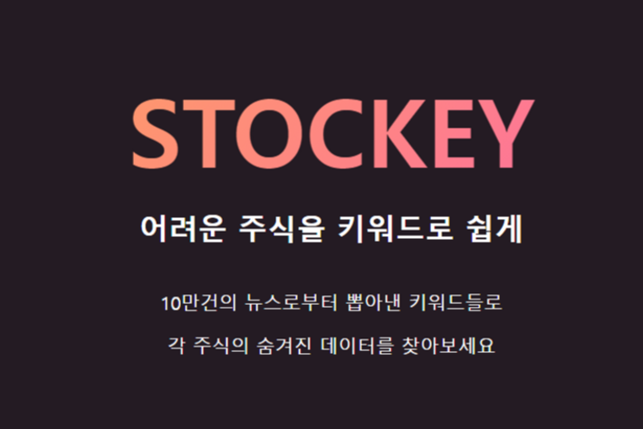
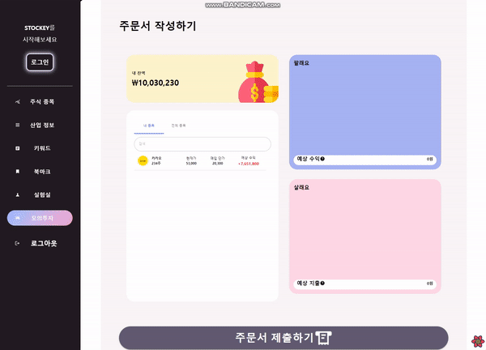

# STOCKEY

## 💬 요약

---



뉴스 키워드와 주가, 산업 사이 상관관계 분석 제공

사용자가 선택한 주식 종목과 키워드의 회귀분석을 통한 예상 주가 정보 제공

## 🛠️ **사용 기술**

---

- TypeScript / HTML5/ CSS(Styled-component)
- React / React-Query / Recoil
- React DnD

## 👨‍👨‍👦**역할**

---

- 총 6명이 함께 진행 (백엔드 3명, 프론트엔드 3명)
- 모의투자 서비스 담당(프론트엔드)

## 👑**성과**

---

- React-Query, Recoil 활용한 전역 변수 및 비동기 데이터 체계적 관리
- Styled Component 활용한 가변 스타일링 적용
- React DnD 라이브러리 적용
- 애자일 방법론 적용

### 🖥️담당 기능

---

### 모의투자 서비스 페이지



- `React-DnD` 활용한 드래그앤 드랍
    - (매수 / 매도)할 주식 종목을 쉽게 드래그 앤 드랍을 통해 사용자 경험 개선
    - (매수 / 매도) 종목을 Session Storage에 Time이랑 함께 저장
        - 매 정각에 거래가 체결되는 서비스로 매 정각마다 초기화 시켜주기 위함

- Sessoin Storage에 시간과 함께 저장하기 위한 함

```jsx
import dayjs from "dayjs"
import { BasketList } from "./TradeForm"

export function setWithExpiry(
  key: string,
  value: object | null,
  currentList: [] | BasketList[]
) {
  const now = dayjs()
  const nextTime = now.add(1, "minute").startOf("minute")
  const item = {
    value: value ? [value, ...currentList] : [...currentList],
    expiry: nextTime.valueOf(),
  }
  localStorage.setItem(key, JSON.stringify(item))
}
```

⚠️ 배운점

- 매 정각마다 현재 잔액, 거래 여부, 장바구니 등등 여러 조건들을 초기화 시켜주기 위해 많은 고민을 했습니다.
    - React-Query를 활용해서 `staleTime` , `cacheTime` 을 활용해 매번 갱신되지 않기 위해 프론트에서의 최적화를 시키며 구현

[◀이전 페이지](https://www.notion.so/bf8192c8e15e48af8ef164ec63672e6b?pvs=21)